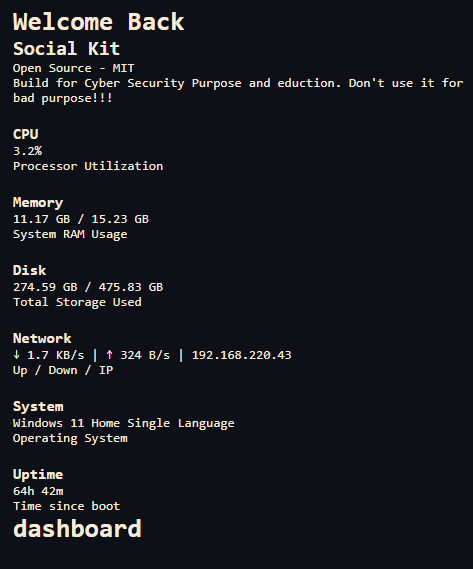
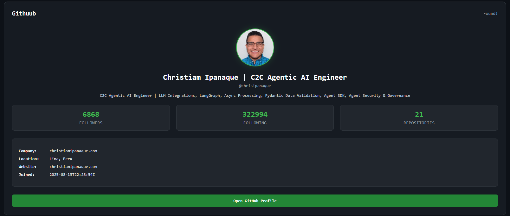
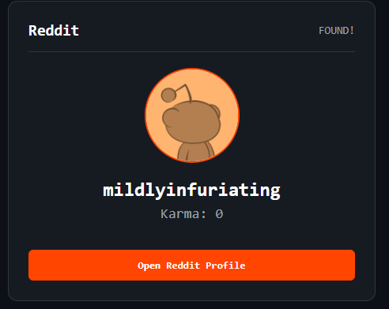
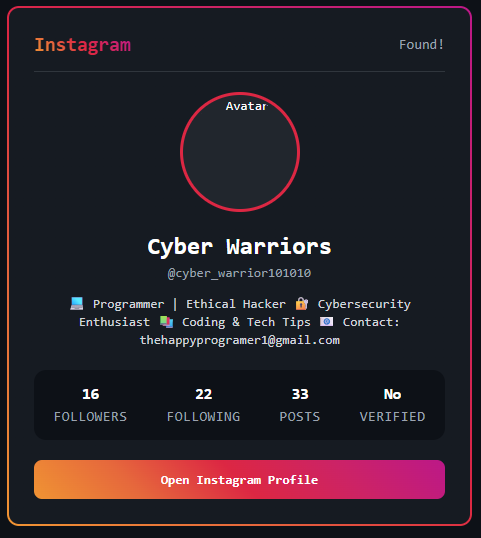
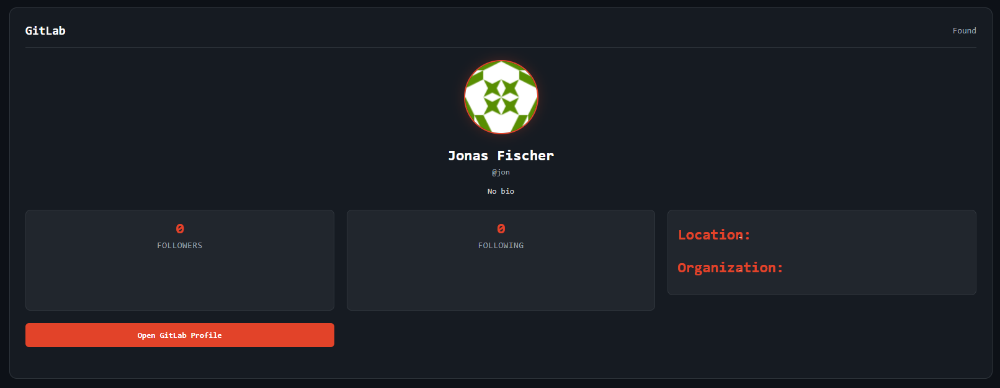
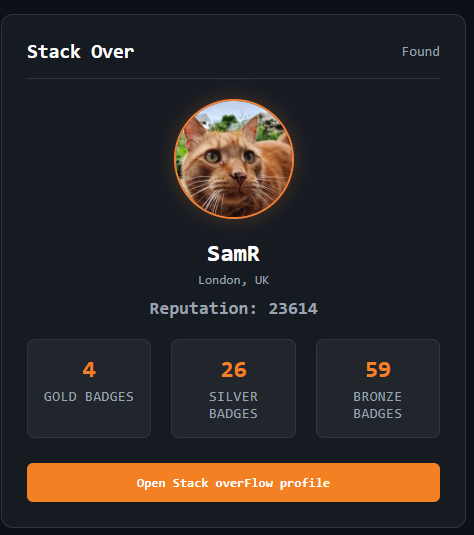

# social-kit
Social-Kit a powerful tool build in rust for security research

# Introduction 
Social-Kit is a powerful tool build in rust for security research, Social-Kit is Collection of so many tools but build in fully pure scratch. Support OSINT, Phising(eduction), Port Scanner, and much more.

### Tech stack
- Tauri
- Rust
- HTML
- css 
- JS
- some rust lib

# features

## Dashboard
dashboard is the main page to open other pages that contain useful tool for recon and some tools that help in phising(eduction)
dashboard you can see:
- CPU
- Memory
- Disk Usage
- Network
- system
- Uptime
of Your Device.

## Port Scanner
port scanner a powerfull module this project

- Support Service see
- More fast scanning

## OSINT
This also a powerfull Spy searching moduke

(Not Fully complted steal have probm)
platform supportted:
- GitHub
- Reddit
- Instgram but steal not properly working :(
- GitLab
- Mastodonn
- Keybase
- Dev.to
- StackOverFlow

GitHub: 
- Avatar Img
- Bio
- Followers
- Following
- Repositories
- Company
- Location
- Website
- Joined

Reddit:
- Karma
- Bio

Instagram (stell a probm):
- Avatar (Not working :())
- Id
- Bio
- Followers
- Following
- Posts

GitLab:
- Avatar
- Name
- Bio
- Followers
- Following
- Location
- Orgranziation

mastodon:
- Avatar
- Name
- Bio
- Followers
- Following
- Post

Keybase:
- Avatar (id)
- Name
- Bio
- Verified
- Followers
- Following

StackOverFlow:
- Avatar
- Name
- Reputation
- Gold Badges
- Silver Badges
- Bronze Badges

Dev.to:
- Avatar
- Name
- Bio
- Followers
- Joined

## NetWork
A powerfull module you scan a domain or ip more info get

-  Ip Adress ping and found (Live/die)
- find domain ip address (Steal not accurte)
- ping status show live monitoring 
- ICMP scan

DNS Intelligence:
- A Records
- AAAA Records
- MX Records
- TXT Records
- NS Records
- CNAME Records

SSL Certificate:
- Subject
- Issuer
- Valid From
- Expires
- TLS Version

Security Header:
- HSTS
- Content-Security-Policy
- X-Frame-Options
- Referrer-Policy
- Permissions-Policy

Website Files:
- robots.txt
- sitemap.xml

Geo Location:
- Country
- Region
- City
- Latitude
- Longitude
- Timezone
- ISP
- Organization

Hosting Interlligence:
- IP
- ISP
- Organization
- ASN
- AS Name

WHOIS / RDAP:
- Registrar
- Creation Date
- Update Date
- Expires Date
- Domain Age
- Nameservers
- Status

Reverse DNS:
- IP
- Hostname

HTTP Information
- Status Code
- Server
- X-Powered-By
- Content-Type
- Content-Length
- Final URL
- Technologies